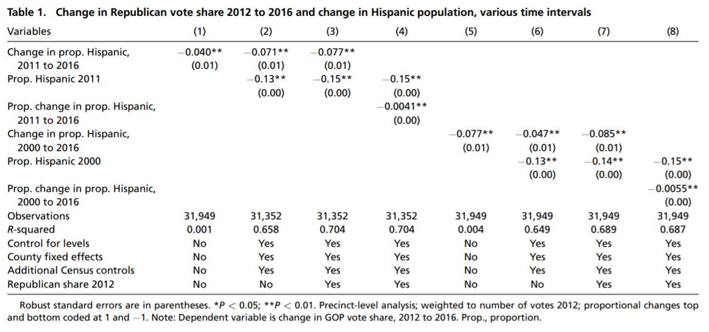

```{r setup, include=FALSE}
knitr::opts_chunk$set(echo = FALSE)


library(haven)
library(tinytex)
library(stargazer)
library(ggplot2)
library(ggthemes)
library(tidyverse)
library(gt)
library(broom)
library(cowplot)
library(plm)

```


```{r data setup}

# Here I load two of the original datsets, which I will use to replicate the main
# results of Hopkins, Hilla, and Huber.

geo_scope <- read_dta("dataverse_files/HHHDemogThreatRepArchive/GeographicScopeData.dta")
  
precinct_data <- read_dta("dataverse_files/HHHDemogThreatRepArchive/PrecinctData.dta")

```

\newpage
# Abstract {-}

Hilla, Hopkins, and Huberc (2019) argue that demographic changes are not associated with increased Republican vote share at the precinct level between 2012 and 2016. I succesfully replicated Hilla, Hopkins and Huberc’s results. A robustness test using a subset analysis focusing on the state of FL indicates, despite minor state-specific deviance and poor statistical significance due to reduced sample size, that the authors' overall findings are valid. Another test focusing on the effect of any individual state on the overall outcome was also found to support the original paper's robustness. In addition, I constructed a fixed effects model by state, which further confirmed original findings even under fixed effects assumptions. In a twist of analysis, I constructed a new model analyzing the association between Republican vote share and economic indicators while controlling for change in percent Hispanic. The latter models indicate a stronger relationship between unemployment proportion change and GOP vote share, which suggests an opportunity for further research with alternative theoretical pathways involving economic indicators. 


# Introduction {-}

Immigration and demographic changes have become salient in American political discourse in great part due to Trump's campaign for the 2016 election. Inspired by previous inconclusive research on threatened response and county-level electoral outcomes, Hilla, Hopkins, and Huberc, henceforth HHH, compiled a novel, precinct-level data set of election results and census demographic measures for almost 32,000 precincts across 7 states to explore how demographic changes influenced republican vote share in affected precincts across the United States. The authors employed regression models with varying explanatory variables and measures of demographic change. Through this analysis, the authors find consistent evidence that 'influxes of Hispanics or non-citizen immigrants' were associated with decreased Republican vote share, which was assumed by the authors to mean shifts towards Trump's opponent in 2016 [@research]. Dan Hopkins offers an overview and a link to the data for this research paper on [his website](http://web.sas.upenn.edu/danhop/research/">his website). The full original paper, [linked here,](https://www-pnas-org.ezp-prod1.hul.harvard.edu/content/pnas/116/50/25023.full.pdf) can be found online through PNAS.org or Harvard's Hollis system.


Using R and RStudio, I succesfully replicated HHH’s results, except for minor discrepancies which do not affect their conclusions [@R]. Some of these discepancies can be associated with the inherent assumptions of the Stata software versus R. The replication process was lengthy and focused mainly on translating local variables from Stata (the coding language in which the original analysis was conducted) into R using the original datasets to construct the main eight models supporting the argument. A step by step replication of the 8 main models and graphics of the paper are included in the appendix. Thanks to the generosity of the authors, the code and data used in this project are available at [Harvard Dataverse](https://dataverse.harvard.edu/dataset.xhtml?persistentId=doi:10.7910/DVN/J5GCZQ). For more information about this project, please visit my project's Github repo^[[The data and code for this project can be found in Github.](https://github.com/deboragonzalez/gop_voters_hisp_changes)].


```{r graphic, warning = FALSE}

# This graphic is an initial attempt to replicate Fig. 1A from the paper, which
# later became a figure in my own replication:

# Change in Republican vote share, 2012 to 2016, and change in Hispanic
# population 2011-2016. Note: Points are random samples of 2,000 precincts.
# Loess lines are generated from all observations. Points are shaded
# corresponding to density, with darker colors indicating more precincts.

# My graphic complies with the first two lines of that description. I am using
# the sample function to get a random sample from my geo_scope dataset. I used
# the geoscope dataset because I wanted to color the dots by state, which the
# authors do not do, but I thought would be interesting and prettier. I was able
# to create the loess line using geom_smooth, which does not appear disimilar to
# the paper's model. I also added the aesthetic enhancement of size as number of
# voters in 2016 in each precinct.

geo_scope2 <- geo_scope %>% 
  drop_na()

try2 <- sample_n(geo_scope2, 2000)
  
# With every sample ran a different number of non-finite/missing values exists,
# and a warning sign appears. Because these values are not relevant to the
# graphic I'm constructing, I will ignore this warnings.


try2 %>% 
  ggplot(aes(x = gop_propvote_change, y = d1611_hispanic, size = Total_Voters_2016_Prct)) + 
  
  # gop_propvote_change is Change in Prop of Republican Voters 2016-2012
  # d1611_hispanic is Change in Prop of Hispanic 2011-2016
  # Total_Voters_2016_Prct is total number of voters by precinct
  
  geom_point(aes(color = st), alpha = 0.5) +
  
  # st refers to state label
  
  stat_smooth(method = "loess", formula = y ~ x, size = 1, se = FALSE) +
  
  # Method loess is a smoothing method that acts much like a regression, but it
  # is not linear.
  
  xlim(-.3,.3) +
  
  # This will emphasize the part of the graph that is most dense.
  
  labs(title = "Figure 1: Republican Vote Share Change vs. Hispanic Population Share Change",
       subtitle = "How changes in hispanic population share from 2011 to 2016 relate \nto changes in GOP Votes share from the 2012 to the 2016 election", 
       caption = "Source: HHH Demographic Threat Data Archive: Geo_Scope",
       x = expression(Delta*" Republican Vote Share 2012-2016"),
       y = expression(Delta*" Hispanic Population Share 2011-2016"),
       size = "Number of Voters \nby Precinct in 2016",
       color = "State") + 
  theme_classic()
 
  
```
Figure 1 shows a visual association between changes of Republican Vote Share and Hispanic Population Proportion Change from 2012-2016. Random sample of 2000 precincts colored by state [@ggplot]. A loess line highlights the general trend of the data [@smooth]. The size feature is an aesthetic enhancement presenting the number of voters per precinct in 2016 [@data].
 
 
I determined two main ways to examine the robustness of these models: 1) I examine state effects first by constructing the same models using a subset of data by state. In this case, I used Florida, which is my home state and one that has received a very high influx of hispanics over the last decade. Despite the smaller sample, which inherently causes decreased statistical significance, HHH's overall conclusions are validated. In addition, I constructed a series of models excluding a different state each time to examine whether any single state was driving HHH's findings and found that no individual state is overwhelmingly shaping the original conclusions. 2) I also examine whether a fixed effects model challenges the authors. Heterogeneity in fixed effects models means different means among categories such as states and year. Unobserved heterogeneity is simply variation/differences among cases which are not measured. When the data can be grouped by such categories (i.e. state), and there are also some evidences indicating heterogeneity, the OLS is not sufficient to control the effects of these unobservable factors [@fixed]. However, fixed effects models can control and estimate these effects, so I constructed mirror models using plm(y ~ x, data = mydata, within = “state”) and found that fixed effects versions of the models do not alter the overarching conclusions even when absorbing the effects particular to each state [@fixed2]. Both methods resulted in successful measures of robustness confirming HHH's original quantitative findings, if not the exact theoretical claim. 

In addition to exploring the robustness of HHH's findings, I built a new model using the original datasets to explore the association between economic indicators and changes in share of Republican voters. I constructed a series of models that explain shifts in GOP share of voters in terms of changes in hispanic proportion, changes in unemployment, and proportion change of poor to consider the economic influences on the share of Republican voters at the precinct level respectively and in combination. In addition, I construct a model to examine how the interaction of change in unemployment and change in Hispanic proportion affect GOP vote share in each time period. I also construct a model using only changes in unemployment and proportion change of poor as explanatory variables to GOP share in this interval. The results show that unemployment may have an even stronger effect on GOP share of voters between 2011-2016 than any other explanatory variable, indicating an interesting trend in the way voters appear to be penalizing candidates in general elections.

Through a brief overview of the relevant literature and a visual presentation of the data, I introduce the scope of this project. I then conduct 3 robustness tests to examine the validity and reliability of HHH's findings and later expand their analysis through a new model exploring economic indicators' and their relation to GOP vote share in association with changes in Hispanic population proportion. I include an appendix with my R-based replication of the main models of the original paper. 
 


# Paper & Literature Review {-}


As HHH explain in their paper, "immigration and demographic change have become highly salient in American politics, partly because of the 2016 campaign of Donald Trump" [@research]. President Trump's victory seemed to solidify the previously proposed notion that demographic changes lead to "threatened reponse" in native voters realigning voting patterns on "the basis of ethnicity, nativity, nationalism, and education" [@research]. This theory implies that as demographic changes occur, native voters shift towards more populist and outspoken anti-immigration candidates. Research of anti-immigrant and Brexit, U.K. independent party, support in the United Kingdom found that these attitudes are higher in "localities that have low immigrant shares but recent demographic changes" [@brexit]. This trend is also true of other countries in continental Europe. In the United States, previous research with county-level data have shown that pro-GOP shifts are only associated with increases in low-skilled immigrants while increases in high-skill immigrants actually increases support for the Democratic parties [@usimpact]. 

Other studies at the county-level have also found an association between percentage increase in Hispanic population and shifts to the Republican Party from 2012-2016 [@enos1]. Reny, Collingwood, and Valenzuela (2019), another study on Trump's political victory, finds that racial attitudes, and not economics, are largely associated with the shift in working-class whites' vote in 2016. However, their findings are not associated with local influx of Hispanics or demographic shifts, but rather the nationalist rethoric of the candidate [@ref28]. Consequently, the theory remains inconclusive as Reny, Collingwood, and Valenzuela failed to find such a strong relationship between proportion change of Hispanics and Republican support at the local level and Newman, Shah, and Collingwood (2018) "show that the relationship between local demographic change and Trump favorability among Republicans was time-dependent" [@ref29].


HHH combined American Community Survey (ACS) data and Census data to construct measures of demographic changes for 2000 to 2016 and 2011 to 2016. These time intervals capture "2 theoretically distinct characterizations of immigrant threat" [@research]. First, HHH noted the potential for citizens' anxiety caused by "cumulative, long term changes in local demographics" that could have been activated by Trump’s candidacy. HHH also noted the theoretical pathway where "more recent changes are most salient for individuals’ perceptions of their local communities," which would result in more immediate threatened response [@research]. Using a precinct-level dataset of election results and demographic measures for almost 32,000 precincts in the states of Florida, Georgia, Michigan, Nevada, Ohio, Pennsylvania, and Washington, HHH find that the influxes in Hispanic and foreign born groups did not influence voting behavior in favor of Trump, but rather (in a slight way) benefited his opponent in those particular areas. 

HHH employ OLS regression analyses with varying explanatory variable(s) specifications and measures of 'demographic change' resulting in 8 main regression models as well as loess lines that visually and mathematically demonstrate the relevant results. They study change in proportion of Hispanics and proportion change of Hispanic proportions concluding that in places with demographic shifts, Trump did not benefit, but, in fact, Clinton did. In other words, local demographic changes are not, on their own, increasing support for anti-immigration candidates. HHH argue that this means the precincts in question are not engaging in the previously studied “threatened response” associated with voting behavior in light of immigration influxes. The authors acknowledge that "despite its disparate local impacts, immigration may be a symbolic, nationalized issue whose effects, do not depend on local experiences" [@research]. However, the actual connection has yet to be proven empirically and it is tough to address it given several exogenous factors influencing voting patterns. Some of these factors include, but are not limited to, greater exposure to international trade and declining economic prospects for the less educated. Despite these unexplored conditions, the authors explain that 'positive intergroup contact' could be responsible for the seemingly 'supportive' voting patterns at low levels of aggregation (locally). This idea is partially supported by Enos (2014), whose study shows how individuals with long(er) exposures to minority groups, tend to have less exclusionary attitudes than those who are exposed to them only briefly or those who have never been exposed at all [@enos2]. Notably, there seems to be a slight discrepancy between the apparent theoretical discussion and the actual numerical findings. The authors discuss the research in light of the different ways in which influx of immigrants affect voters' response, but the variables used in this analysis mainly focus on influx of Hispanics, who may or may not be immigrants themselves. 


# Replication {-}

I was able to successfully translate and replicate the main analysis of the original paper despite minor deviances that did not affect the overall conclusions of the study. Since the original analysis was done in Stata, this project required the translation of the code and a comparative analysis between the replicated and original output. A full replication of Table 1 and Figure 1  of the original paper using the most approximate R tools can be found in the appendix. 


# Robustness Check #1 & #2: Subsetting the Data {-}

One way to test for robustness is to examine the ways in which different states affect the overall trends. Notably, if a subset of the data has largely skewed results, the original findings are not invalidated given the diminished statistical significance of the subset, but the results' predictive applicability and generizability can be questioned. For this project, I decided to run the main 8 original models on a smaller subset of the data - the precincts in the state of Florida. Examining the single state allowed me to zoom in and see how these associations look like in a state that is increasingly known as a swing state in U.S. elections. 

```{r fl_subset, results="asis"}

fl_data <- precinct_data %>% 
  filter(st == "FL")

flm1 <- lm(gop_propvote_change ~ d1611_hispanic, data = fl_data, weights = weight) 


# Regression Model 2:


flm2 <- lm(gop_propvote_change ~ d1611_hispanic + l11_hispanic + d1611_poor + d1611_unemp + 
           d1611_rent + d1611_rent_income + d1611_housing_150 + d1611_mfg + d1611_pop + 
           l11_poor + l11_unemp + l11_rent + l11_rent_income + l11_housing_150 + l11_mfg + 
           l11_density + l11_black + l11_educba + countyid, 
         data = fl_data, 
         weights = weight) 


#Regression Model 3:


flm3 <-  lm(gop_propvote_change ~ d1611_hispanic + l11_hispanic + d1611_poor + d1611_unemp + 
           d1611_rent + d1611_rent_income + d1611_housing_150 + d1611_mfg + d1611_pop + 
           l11_poor + l11_unemp + l11_rent + l11_rent_income + l11_housing_150 + l11_mfg + 
           l11_density + l11_black + l11_educba + countyid + decile_repvote12, 
         data = fl_data, 
         weights = weight) 


# Regression Model 4:

flm4 <-  lm(gop_propvote_change ~  dprop1611_hispanic + l11_hispanic + d1611_poor + d1611_unemp + 
           d1611_rent + d1611_rent_income + d1611_housing_150 + d1611_mfg + d1611_pop + 
           l11_poor + l11_unemp + l11_rent + l11_rent_income + l11_housing_150 + l11_mfg + 
           l11_density + l11_black + l11_educba + countyid + decile_repvote12, 
         data = fl_data, 
         weights = weight) 


# Regression Model 5:


flm5 <- lm(gop_propvote_change ~ d1600_hispanic, 
         data = fl_data, 
         weights = weight) 


# Regression Model 6:


flm6 <- lm(gop_propvote_change ~ d1600_hispanic + l00_hispanic + d1600_poor + d1600_unemp + 
           d1600_mfg + d1600_pop + l00_poor + l00_unemp + l00_mfg + l00_density + l00_black + 
           l00_educba + countyid,
         data = fl_data,
         weights = weight)


# Regression Model 7:
# regress `dv' `iv_c_1600' `cv_c_1600' `cv_l_1600' rv12d_* [aweight=weight], robust

flm7 <- lm(gop_propvote_change ~ d1600_hispanic + l00_hispanic + d1600_poor + d1600_unemp + 
           d1600_mfg + d1600_pop + l00_poor + l00_unemp + l00_mfg + l00_density + l00_black + 
           l00_educba + countyid + decile_repvote12,
         data = fl_data,
         weights = weight)


# Regression Model 8:
# regress `dv' `iv_pc_1600' `cv_c_1600' `cv_l_1600'  rv12d_* [aweight=weight], robust

flm8 <- lm(gop_propvote_change ~ dprop1600_hispanic + l00_hispanic + d1600_poor + d1600_unemp + 
           d1600_mfg + d1600_pop + l00_poor + l00_unemp + l00_mfg + l00_density + l00_black + 
           l00_educba + countyid + decile_repvote12,
         data = fl_data,
         weights = weight)


stargazer(flm1, flm2, flm3, flm4, flm5, flm6, flm7, flm8,
          title = "Change in Republican vote share 2012 to 2016 and change in Hispanic population, various time intervals in FL",
         omit = c("d1611_poor", "d1611_unemp", "d1611_rent", "d1611_rent_income", "d1611_housing_150", "d1611_mfg",
                  "d1611_pop", "l11_poor", "l11_unemp", "l11_rent", "l11_rent_income", "l11_housing_150", "l11_mfg",
                  "l11_density", "l11_black", "l11_educba", "countyid", "d1600_poor", "d1600_unemp", "d1600_mfg",
                  "d1600_pop", "l00_poor", "l00_unemp", "l00_mfg", "l00_density", "l00_black", "l00_educba",
                  "decile_repvote12"),
                  covariate.labels = c("Change in Prop. Hispanic, 2011 to 2016", "Prop. Change in Prop. Hispanic, 2011 to 2016",
                              "Prop. Hispanic 2011", "Prop. Change in Prop. Hispanic, 2000 to 2016",
                              "Change in Prop. Hispanic, 2000 to 2016","Prop. Hispanic 2000"),
         omit.stat = c("f", "ser"),
         dep.var.labels.include = TRUE, 
         dep.var.labels = "GOP Vote Share Change, 2012 to 2016",
         
         # Need to work on getting rid of dependent variable row.
         
         column.sep.width = "-20pt",
         no.space = T,
         notes.align = "l",
         notes = "\\parbox[t]{10cm}{Robust standard errors are in parentheses. Precinct-level analysis in FL; weighted to number of votes 2012; proportional changes top and bottom coded at 1 and −1. Note lower statistical significance and some small flips in coefficient sign.}",
         notes.append = TRUE,
         header = F)

# *P < 0.05; **P < 0.01. Precinct-level analysis; weighted to number of votes 2012; proportional changes top
# and bottom coded at 1 and −1. Note: Dependent variable is change in GOP vote share, 2012 to 2016. Prop., proportion.
```


Despite the lack of statistical significance across many of the coefficients in Table 1, comparing these models' output and their significance to those of the original data models solidifies HHH's central finding as even a small subset of the data seems to confirm their overarching conclusion that demographic shifts do not lead to increased GOP share of votes, but rather the opposite. I think the question can now become whether or not the influx of hispanics can be interpreted as an influx of immigrants (which is a big discussion in the theoretical part of the original paper) or if it simply refers to U.S. born Hispanics, which have been found in previous research to vote in favor of Democratic candidates. In the main eight regressions explored in the study, foreign born population is not included as an explanatory variable control, so this change in Hispanic proportion can be assumed to include any Hispanic in America. Notably, the appendix of the original paper contains a table that explores the effect of foreign born changes on GOP vote share. Perhaps the relationships uncovered through those models can help clarify the more specific claim discussed in the literature. Unfortunately, I was unable to gain access to the appendix for this project. Overall, these models serve as a robustness check to HHH's findings and provide some insight into the consequences of slicing the data in different ways and the potential effect individual states may be having on the data as a whole, which is further explored in the next set of models.


Another similar, but more extensive way to test for robustness, is to build a series of models in which a different state is substracted from the sample each time. This allows us to observe whether the overall trend is largely skewed by any individual state.


```{r state effect, results="asis"}

# Evaluating individual state effects mirroring original Model 3 (2011-2016):

# The states: Florida, Georgia, Michigan, Nevada, Ohio, Pennsylvania, and Washington

# The datasets minus 1 state:

no_FL <- precinct_data %>% 
  filter(st != "FL")

no_GA <- precinct_data %>% 
  filter(st != "GA")
  
no_MI <- precinct_data %>% 
  filter(st != "MI")
  
no_NV <- precinct_data %>% 
  filter(st != "NV")
  
no_OH <- precinct_data %>% 
  filter(st != "OH")

no_PA <- precinct_data %>% 
  filter(st != "PA")

no_WA <- precinct_data %>% 
  filter(st != "WA")

# Model 3 minus one state:

noFL <-  lm(gop_propvote_change ~ d1611_hispanic + l11_hispanic + d1611_poor + d1611_unemp + 
           d1611_rent + d1611_rent_income + d1611_housing_150 + d1611_mfg + d1611_pop + 
           l11_poor + l11_unemp + l11_rent + l11_rent_income + l11_housing_150 + l11_mfg + 
           l11_density + l11_black + l11_educba + countyid + decile_repvote12, 
         data = no_FL, 
         weights = weight)

noGA <-  lm(gop_propvote_change ~ d1611_hispanic + l11_hispanic + d1611_poor + d1611_unemp + 
           d1611_rent + d1611_rent_income + d1611_housing_150 + d1611_mfg + d1611_pop + 
           l11_poor + l11_unemp + l11_rent + l11_rent_income + l11_housing_150 + l11_mfg + 
           l11_density + l11_black + l11_educba + countyid + decile_repvote12, 
         data = no_GA, 
         weights = weight) 

noMI <-  lm(gop_propvote_change ~ d1611_hispanic + l11_hispanic + d1611_poor + d1611_unemp + 
           d1611_rent + d1611_rent_income + d1611_housing_150 + d1611_mfg + d1611_pop + 
           l11_poor + l11_unemp + l11_rent + l11_rent_income + l11_housing_150 + l11_mfg + 
           l11_density + l11_black + l11_educba + countyid + decile_repvote12, 
         data = no_MI, 
         weights = weight) 

noNV <-  lm(gop_propvote_change ~ d1611_hispanic + l11_hispanic + d1611_poor + d1611_unemp + 
           d1611_rent + d1611_rent_income + d1611_housing_150 + d1611_mfg + d1611_pop + 
           l11_poor + l11_unemp + l11_rent + l11_rent_income + l11_housing_150 + l11_mfg + 
           l11_density + l11_black + l11_educba + countyid + decile_repvote12, 
         data = no_NV, 
         weights = weight) 

noOH <-  lm(gop_propvote_change ~ d1611_hispanic + l11_hispanic + d1611_poor + d1611_unemp + 
           d1611_rent + d1611_rent_income + d1611_housing_150 + d1611_mfg + d1611_pop + 
           l11_poor + l11_unemp + l11_rent + l11_rent_income + l11_housing_150 + l11_mfg + 
           l11_density + l11_black + l11_educba + countyid + decile_repvote12, 
         data = no_OH, 
         weights = weight) 

noPA <-  lm(gop_propvote_change ~ d1611_hispanic + l11_hispanic + d1611_poor + d1611_unemp + 
           d1611_rent + d1611_rent_income + d1611_housing_150 + d1611_mfg + d1611_pop + 
           l11_poor + l11_unemp + l11_rent + l11_rent_income + l11_housing_150 + l11_mfg + 
           l11_density + l11_black + l11_educba + countyid + decile_repvote12, 
         data = no_PA, 
         weights = weight) 

noWA <-  lm(gop_propvote_change ~ d1611_hispanic + l11_hispanic + d1611_poor + d1611_unemp + 
           d1611_rent + d1611_rent_income + d1611_housing_150 + d1611_mfg + d1611_pop + 
           l11_poor + l11_unemp + l11_rent + l11_rent_income + l11_housing_150 + l11_mfg + 
           l11_density + l11_black + l11_educba + countyid + decile_repvote12, 
         data = no_WA, 
         weights = weight) 


stargazer(noFL, noGA, noMI, noNV, noOH, noPA, noWA,
          title = "Change in Republican vote share 2012 to 2016 and change in Hispanic population",
         omit = c("d1611_poor", "d1611_unemp", "d1611_rent", "d1611_rent_income", "d1611_housing_150", "d1611_mfg",
                  "d1611_pop", "l11_poor", "l11_unemp", "l11_rent", "l11_rent_income", "l11_housing_150", "l11_mfg",
                  "l11_density", "l11_black", "l11_educba", "countyid", "d1600_poor", "d1600_unemp", "d1600_mfg",
                  "d1600_pop", "l00_poor", "l00_unemp", "l00_mfg", "l00_density", "l00_black", "l00_educba",
                  "decile_repvote12"),
                  covariate.labels = c("Change in Prop. Hispanic, 2011 to 2016",
                              "Prop. Hispanic 2011"),
         omit.stat = c("f", "ser"),
         dep.var.labels.include = TRUE, 
         dep.var.labels = "GOP Vote Share Change, 2012 to 2016",
         
         # Need to work on getting rid of dependent variable row.
         
         column.sep.width = "-8pt",
         no.space = T,
         object.names = TRUE, model.numbers = FALSE,
         notes.align = "l",
         notes = "\\parbox[t]{10cm}{Robust standard errors are in parentheses. Precinct-level Model 3 analysis with census controls excluding 1 state in each sample; weighted to number of votes 2012; proportional changes top and bottom coded at 1 and −1.}",
         notes.append = TRUE,
         header = F)


```

The coefficients of these models (each of which excludes a different state) consistently support HHH's findings and conclude that the results are not driven by any single state. 

# Robutness Check #3: Fixed Effects Model {-}


In statistics, a model that has fixed parameters or non-random quantities is called a fixed effects model. In general, based on some observed factors, data can be divided into groups. The group means could be assumed as constant or non-constant across groups. In a fixed effects model, just as its name implies, each group mean is a specifically fixed quantity. Furthermore, the assumption of fixed effect is that the group-specific effects are correlated with the independent variables. Heterogeneity in fixed effects models means different means among categories such as states. Unobserved heterogeneity is simply variation/differences among cases which are not measured. When the data can be grouped by such categories, and there is also some evidence indicating heterogeneity, the OLS is not sufficient to control the effects of these unobservable factors. However, fixed effects models can control and estimate these effects. The plm fixed effects model essentially captures any and all systematic differences across precincts that are state-invariant. Transforming the original models into fixed effects models, I test whether the state induced heterogeneity impacts HHH's overall findings.


```{r clusters, results="asis"}


plm1 <- plm(gop_propvote_change ~ d1611_hispanic, data = precinct_data, weights = weight, model = 'within', index = 'st')

plm2 <- plm(gop_propvote_change ~ d1611_hispanic + l11_hispanic + d1611_poor + d1611_unemp + 
           d1611_rent + d1611_rent_income + d1611_housing_150 + d1611_mfg + d1611_pop + 
           l11_poor + l11_unemp + l11_rent + l11_rent_income + l11_housing_150 + l11_mfg + 
           l11_density + l11_black + l11_educba + countyid, 
         data = precinct_data, 
         weights = weight,
         model = 'within', 
         index = 'st') 

plm3 <- plm(gop_propvote_change ~ d1611_hispanic + l11_hispanic + d1611_poor + d1611_unemp + 
           d1611_rent + d1611_rent_income + d1611_housing_150 + d1611_mfg + d1611_pop + 
           l11_poor + l11_unemp + l11_rent + l11_rent_income + l11_housing_150 + l11_mfg + 
           l11_density + l11_black + l11_educba + countyid + decile_repvote12, 
         data = precinct_data, 
         weights = weight,
         model = 'within', 
         index = 'st')


plm4 <- plm(gop_propvote_change ~  dprop1611_hispanic + l11_hispanic + d1611_poor + d1611_unemp + 
           d1611_rent + d1611_rent_income + d1611_housing_150 + d1611_mfg + d1611_pop + 
           l11_poor + l11_unemp + l11_rent + l11_rent_income + l11_housing_150 + l11_mfg + 
           l11_density + l11_black + l11_educba + countyid + decile_repvote12, 
         data = precinct_data, 
         weights = weight,
         model = 'within', 
         index = 'st')

plm5 <- plm(gop_propvote_change ~ d1600_hispanic, 
         data = precinct_data, 
         weights = weight,
         model = 'within', 
         index = 'st')
  
  

plm6 <- plm(gop_propvote_change ~ d1600_hispanic + l00_hispanic + d1600_poor + d1600_unemp + 
           d1600_mfg + d1600_pop + l00_poor + l00_unemp + l00_mfg + l00_density + l00_black + 
           l00_educba + countyid,
         data = precinct_data,
         weights = weight,
         model = 'within', 
         index = 'st')
  
  
plm7 <- plm(gop_propvote_change ~ d1600_hispanic + l00_hispanic + d1600_poor + d1600_unemp + 
           d1600_mfg + d1600_pop + l00_poor + l00_unemp + l00_mfg + l00_density + l00_black + 
           l00_educba + countyid + decile_repvote12,
         data = precinct_data,
         weights = weight,
         model = 'within', 
         index = 'st')

  
plm8 <- plm(gop_propvote_change ~ dprop1600_hispanic + l00_hispanic + d1600_poor + d1600_unemp + 
           d1600_mfg + d1600_pop + l00_poor + l00_unemp + l00_mfg + l00_density + l00_black + 
           l00_educba + countyid + decile_repvote12,
         data = precinct_data,
         weights = weight,
         model = 'within', 
         index = 'st')

stargazer(plm1, plm2, plm3, plm4, plm5, plm6, plm7, plm8,
          title = "Change in Republican vote share 2012 to 2016 and change in Hispanic population, various time intervals, fixed effects by State",
         omit = c("d1611_poor", "d1611_unemp", "d1611_rent", "d1611_rent_income", "d1611_housing_150", "d1611_mfg",
                  "d1611_pop", "l11_poor", "l11_unemp", "l11_rent", "l11_rent_income", "l11_housing_150", "l11_mfg",
                  "l11_density", "l11_black", "l11_educba", "countyid", "d1600_poor", "d1600_unemp", "d1600_mfg",
                  "d1600_pop", "l00_poor", "l00_unemp", "l00_mfg", "l00_density", "l00_black", "l00_educba",
                  "decile_repvote12"),
         covariate.labels = c("Change in Prop. Hispanic, 2011 to 2016", "Prop. Change in Prop. Hispanic, 2011 to 2016", "Prop. Hispanic 2011", "Prop. Change in Prop. Hispanic, 2000 to 2016", "Change in Prop. Hispanic, 2000 to 2016","Prop. Hispanic 2000"),
         omit.stat = c("f", "ser"),
         dep.var.labels.include = TRUE, 
         dep.var.labels = "GOP Vote Share Change, 2012 to 2016",

         # something strange is happening with spacing. I solved it by getting
         # rid of the table.placement call.
         
         column.sep.width = "-15pt",
         no.space = TRUE,
         notes.align = "l",
         notes = "\\parbox[t]{10cm}{Precinct-level fixed effects analysis by state; weighted to number of votes 2012; proportional changes top and bottom coded at 1 and −1.}",
         notes.append = TRUE,
         # table.placement = "H",
         header = F)
```

Table 3 shows a lack of statistical significance for Models #1 and #5 compared to the original and replicated models, which show statistical significance across all 8 models. Notably, the overall effect of Hispanic proportion change on Republican vote share appears weak and unreliable when accounting for the systematic differences across states (the fixed effects model). However, the direct effect seems clearer as more explanatory variables are added. These coefficients are similar in sign and magnitude to the original findings and support HHH's conclusions.


# A New Model: Economic Indicators & Hispanic Population Change {-}


Notably, HHH's findings are robust and I wanted to further explore the relationship they identified to examine whether there may be alternative theoretical pathways through which this relationship exists. The literature suggests that economic factors may play a role in the effect of racial rethoric in the political arena [@usimpact]. The models I built isolate economic indicators - measure of unemployment and change in proportion of poor - to explore their effect on republican vote share as well as their association to hispanic proportion changes.

```{r econ, results="asis"}

# 2011-2016

# Because of multi-collinearity concerns, I'm creating a model for change in prop.
# unemployed and one for change in prop. poor while interacting these explanatory
# variables with change in prop. hispanic.

ecm1 <- lm(gop_propvote_change ~ d1611_hispanic + d1611_unemp, data = precinct_data, weights = weight)

ecm1.5 <- lm(gop_propvote_change ~ d1611_hispanic*d1611_unemp, data = precinct_data, weights = weight) 

# I considered using the proportion of poor and unemployed (l11_poor +
# l11_unemp), but figured the prop change would be a more appropriate value as
# it shows the effect of change on the change in GOP share.

ecm2 <- lm(gop_propvote_change ~ d1611_hispanic + d1611_poor, data = precinct_data, weights = weight)

ecm2.5 <- lm(gop_propvote_change ~ d1611_hispanic*d1611_poor, data = precinct_data, weights = weight) 

ecm3 <- lm(gop_propvote_change ~ d1611_hispanic + d1611_poor + d1611_unemp, data = precinct_data, weights = weight) 
 


stargazer(ecm1, ecm1.5, ecm2, ecm2.5, ecm3,
          title = "Change in Republican vote share 2012 to 2016 and change in Economic Indicators and Hispanic population, various time intervals",
         omit.stat = c("f", "ser"),
         covariate.labels = c("Change in Prop. Hispanic, 2011 to 2016", "Change in Prop. Unemployed, 2011 to 2016", "Interaction: Chg Prop. Hisp 11-16 and Chg Prop. Unemp. 11-16", "Change in Prop. Poor, 2011 to 2016", "Interaction: Chg Prop. Hisp 11-16 and Chg Prop. Poor 11-16"),
         dep.var.labels.include = TRUE, 
         dep.var.labels = "GOP Vote Share Change, 2012 to 2016",
         
         column.sep.width = "-10pt",
         no.space = T,
         notes.align = "l",
         notes = "\\parbox[t]{8.2cm}{Precinct-level economic effects analysis from 2011 to 2016. Not all models are statistically significant, but special attention should be paid to models 1,3, and 5.}",
         notes.append = TRUE,
         # table.placement = "H",
         header = F)


```

Table 4 explores the association between economic indicators and changes in Republican voters between 2011 and 2016. The first model indicates that increased proportion unemployed between 2011 and 2016 have a larger negative effect on Republican vote share (positive values indicate pro-Republican shifts) than increased Hispanic proportion during the 2011-2016 time period. The magnitude for the unemployment coefficient is significantly larger than that of hispanic proportion change and both values hold statistical significance. Model 3 indicates that changes in proportion of poor is associated with positive change in GOP votes share, a value that is small, but statistically significant. This coefficient suggests that, at a very small scale, an increase in poverty may benefit the GOP. The last model, model 5, shows the effect of each of these explanatory variables when controlling for the others indicating that changes in unemployment has, in fact, a much larger negative effect than Hispanic influx on republican vote share over the 2012-2016 period.

Models 2 and 4 offer inconclusive results due to statistical insignificance. However, they offer insight into potential new models or datasets that can be used for further study. In model 2, we observe the interaction effect between Hispanic change and unemployment change is actually positive suggesting that if there is both an influx of Hispanics and a spike in unemployment, then the Republican vote share would be positively impacted. Notably, this value is not statistically significant due to its large standard error and requires further testing. The interaction between change in proportion of Hispanics and change in proportion of poor in model 4 resulted in a miniscule positive coefficient without statiscal significance, which may indicate Republican favor, but requires further analysis.

Interestingly, the associations in these models indicate potential to explore alternative theoretical pathways to explain the relationship between demographic changes and Republican vote share. As unemployment rises, the Democratic party benefits, which at a high-level seems to support the welfare-related rethoric associated with it. However, when unemployment rises accompanied by an increase in Hispanics, then the GOP benefits suggesting a "deserving/undeserving immigrant" story where well-off (or deserving) minority groups are accepted, but not those deemed undeserving. Perhaps another theoretical approach could be the "race-based blame" argument where an influx of Hispanics is blamed for unemployment increases. It would be interesting to explore how voting patterns change when the unemployed increases pertain to the newly arrived or to the native population. 


```{r econ_fig}


# This plot aims to visualize the association between unemployment prop. changes
# and republican vote share.


fig2a <- augment(ecm1) %>%
  
  # Using the augment function to plot the fitted values.
  
  ggplot(aes(x = d1611_unemp, y = .fitted))+
  geom_line() +
  geom_ribbon(aes(ymin = .fitted - 1.96 * .se.fit,
                  ymax = .fitted + 1.96 * .se.fit),
              alpha = 0.7) +
  labs(title = "",
       subtitle = "",
       x = "Change in Prop. Unemployed, 2011-16",
       y = "Predicted Change in GOP Vote Share") +
  theme_classic()


# This plot aims to visualize the association between hispanic prop change and
# republican vote share.


fig2b <- augment(ecm1) %>%
  ggplot(aes(x = d1611_hispanic, y = .fitted))+
  geom_line() +
  geom_ribbon(aes(ymin = .fitted - 1.96 * .se.fit,
                  ymax = .fitted + 1.96 * .se.fit),
              alpha = 0.7) +
  labs(title = "",
       subtitle = "",
       x = "Change in Prop. Hispanic, 2011-16",
       y = "Predicted Change in GOP Vote Share") +
  theme_classic()

fig2_1 <- plot_grid(fig2a, fig2b, labels = "AUTO")

# now add the caption
title <- ggdraw() + 
  draw_label(
    "Model 1 Visualization",
    fontface = 'bold',
    x = 0,
    hjust = 0
  ) +
  theme(plot.margin = margin(0, 0, 0, 2))
    
    # add margin on the left of the drawing canvas,
    # so title is aligned with left edge of first plot    


fig2 <- plot_grid(title, fig2_1, ncol = 1,
                   rel_heights = c(0.1, 1))

ggdraw(add_sub(fig2, "There is a clearer association between increased unemployment and loss of GOP vote share.", size = 10))

```


# Conclusion {-}

HHH argue that demographic shifts did not benefit Trump at the precinct level during the 2016 election, but rather these shifts benefited his opponent. Through 8 main OLS regression models using precinct-level American Community Survey and Census data, the authors explore the relationship between Hispanic proportion increases and changes in Republican vote share across 7 states. In their analysis they find consistent evidence that hispanic influx was associated with decreased republican vote share. My replication was successful despite the deviances inherent to a translation of the original models into R. 


The three robustness tests applied to HHH's models further confirmed HHH's findings. The Florida subset analysis showed that the authors' general conclusions were applicable to the state despite decreased statistical significance and deviance in some of the models. I successfully concluded that no individual state was the main driver of the original conclusions running model 3 of the original paper on 7 different samples, each of which was missing data for a particular state. Given the data's categorization by state, I was concerned about heterogeneity so I constructed a fixed effects model, which, despite minor discrepancies, supported HHH's results. 


Confirming HHH's models' robustness allowed me to explore a new set of models using economic indicators - change in proportion unemployed and in proportion poor - as explanatory variables to GOP vote share along with change in proportion of Hispanics. The results are intriguing indicating a clearer relationship between increased unemployment and GOP vote share than any of the other variables studied. This finding suggests opportunities for further studies exploring the mechanisms through which unemployment affects the outcome. Notably, a look at alternative theoretical pathways such as the deserving/undeserving immigrant hypothesis or perhaps a 'racially-charged economic-based backlash' theory, emphasizing voters' response to politicians, may be one way to further expand this study. Exploring these theories may require additional data that separates Hispanics that are able to vote from Hispanic immigrants (who have not yet naturalized) in order to identify whether the effects observed are associated with incoming Hispanics voting or a result of local socialization with incoming groups. 

Hispanics comprise a large demographic group that is rapidly growing in the United States. Understanding the influence they have on the nation's politics and political outcomes is essential to academics and politicians alike. HHH's paper offers clear indication that Hispanic presence translates to decreased proportion of Republican voters, but the mechanisms through which this effect occurs is certainly an opportunity for further research. 


\newpage
# Appendix {-}

Results from Hilla, Hopkins, and Huberc (2019) were successfully replicated. As an example, here is Table 1 from page 4.

### Original Table {-}




Table 1 presents multiple least-squares regression estimates of how changes in Hispanic populations at different time intervals correlate with increases in Republican precinct-level vote share between 2012 and 2016.

\newpage
### Replication of Table 1: {-}
```{r table1, results="asis"}

# AnalyzePooledPrecinctLevelFiles.do 

# Estimate the effect of changing Hispanic population on change in Republican
# vote share from 2012 to 2016.

# Note that the authors create local variables in stata that mean different
# variables depending on the model that the regression is running. The local
# variables used in stata for the regressions in Table 1 are outlined within the
# if_else statement starting with "if `modelgroups'==1". The definitions
# outlined in it run through the standard regressions the authors built at the
# bottom of the document that apply to all of the tables/models within the
# if_else statement.


# Table 1 has eight regression models. I'll replicate each of them in R and then
# try to display them all together to mimic the paper's output.


# IMPORTANT: this note refers to the order in which translation of the stata
# local variables should take place.
# Variables to present in the production tables (in order). 
# local keepvars = "`iv_c_1611' `iv_pc_1611' `iv_c_1600'
# `iv_pc_1600' l11_hispanic l00_hispanic l11_foreign l00_foreign"

# Regression Model 1:
# regress `dv' `iv_c_1611' [aweight=weight]

precinct_data <- precinct_data %>% 
  drop_na()

m1 <- lm(gop_propvote_change ~ d1611_hispanic, data = precinct_data, weights = weight) 


# Regression Model 2:
# regress `dv' `iv_c_1611' `cv_c_1611' `cv_l_1611' [aweight=weight], robust

m2 <- lm(gop_propvote_change ~ d1611_hispanic + l11_hispanic + d1611_poor + d1611_unemp + 
           d1611_rent + d1611_rent_income + d1611_housing_150 + d1611_mfg + d1611_pop + 
           l11_poor + l11_unemp + l11_rent + l11_rent_income + l11_housing_150 + l11_mfg + 
           l11_density + l11_black + l11_educba + countyid, 
         data = precinct_data, 
         weights = weight) 

# m2$coefficients <- m2$coefficients[1:3] 
# shows only intercept, Change in prop. Hispanic,2011 to 2016, and Prop. Hispanic 2011


#Regression Model 3:
# regress `dv' `iv_c_1611' `cv_c_1611' `cv_l_1611' rv12d_* [aweight=weight], robust

m3 <-  lm(gop_propvote_change ~ d1611_hispanic + l11_hispanic + d1611_poor + d1611_unemp + 
            d1611_rent + d1611_rent_income + d1611_housing_150 + d1611_mfg + d1611_pop + 
            l11_poor + l11_unemp + l11_rent + l11_rent_income + l11_housing_150 + l11_mfg + 
            l11_density + l11_black + l11_educba + countyid + decile_repvote12, 
          data = precinct_data, 
          weights = weight) 


# I believe that decile_repvote12 combines all of the rv12d_*, which I believe
# is what we are supposed to do,

# m3$coefficients <- m2$coefficients[1:3] 
# shows only intercept, Change in prop. Hispanic,2011 to 2016, and Prop. Hispanic 2011


# Regression Model 4:
# regress `dv' `iv_pc_1611' `cv_c_1611' `cv_l_1611'  rv12d_* [aweight=weight], robust
m4 <-  lm(gop_propvote_change ~  dprop1611_hispanic + l11_hispanic + d1611_poor + d1611_unemp + 
            d1611_rent + d1611_rent_income + d1611_housing_150 + d1611_mfg + d1611_pop + 
            l11_poor + l11_unemp + l11_rent + l11_rent_income + l11_housing_150 + l11_mfg + 
            l11_density + l11_black + l11_educba + countyid + decile_repvote12, 
          data = precinct_data, 
          weights = weight) 


# Regression Model 5:

# regress `dv' `iv_c_1600' [aweight=weight], robust

m5 <- lm(gop_propvote_change ~ d1600_hispanic, 
         data = precinct_data, 
         weights = weight) 


# Regression Model 6:

# regress `dv' `iv_c_1600' `cv_c_1600' `cv_l_1600' [aweight=weight], robust

m6 <- lm(gop_propvote_change ~ d1600_hispanic + l00_hispanic + d1600_poor + d1600_unemp + 
           d1600_mfg + d1600_pop + l00_poor + l00_unemp + l00_mfg + l00_density + l00_black + 
           l00_educba + countyid,
         data = precinct_data,
         weights = weight)


# Regression Model 7:
# regress `dv' `iv_c_1600' `cv_c_1600' `cv_l_1600' rv12d_* [aweight=weight], robust

m7 <- lm(gop_propvote_change ~ d1600_hispanic + l00_hispanic + d1600_poor + d1600_unemp + 
           d1600_mfg + d1600_pop + l00_poor + l00_unemp + l00_mfg + l00_density + l00_black + 
           l00_educba + countyid + decile_repvote12,
         data = precinct_data,
         weights = weight)


# Regression Model 8:
# regress `dv' `iv_pc_1600' `cv_c_1600' `cv_l_1600'  rv12d_* [aweight=weight], robust

m8 <- lm(gop_propvote_change ~ dprop1600_hispanic + l00_hispanic + d1600_poor + d1600_unemp + 
           d1600_mfg + d1600_pop + l00_poor + l00_unemp + l00_mfg + l00_density + l00_black + 
           l00_educba + countyid + decile_repvote12,
         data = precinct_data,
         weights = weight)


stargazer(m1, m2, m3, m4, m5, m6, m7, m8,
          title = "Table 1. Change in Republican vote share 2012 to 2016 and change in Hispanic population, various time intervals",
          omit = c("d1611_poor", "d1611_unemp", "d1611_rent", "d1611_rent_income", "d1611_housing_150", "d1611_mfg",
                   "d1611_pop", "l11_poor", "l11_unemp", "l11_rent", "l11_rent_income", "l11_housing_150", "l11_mfg",
                   "l11_density", "l11_black", "l11_educba", "countyid", "d1600_poor", "d1600_unemp", "d1600_mfg",
                   "d1600_pop", "l00_poor", "l00_unemp", "l00_mfg", "l00_density", "l00_black", "l00_educba",
                   "decile_repvote12"),
          covariate.labels = c("Change in Prop. Hispanic, 2011 to 2016", "Prop. Change in Prop. Hispanic, 2011 to 2016",
                               "Prop. Hispanic 2011", "Prop. Change in Prop. Hispanic, 2000 to 2016",
                               "Change in Prop. Hispanic, 2000 to 2016","Prop. Hispanic 2000"),
          omit.stat = c("f", "ser"),
          dep.var.labels.include = FALSE,
          
          # Need to work on getting rid of dependent variable row.
          
          column.sep.width = "-15pt",
          no.space = T,
          header = F)

# float.env = "sidewaystable")
# This was not necessary in the end bc I was able to reduce size.

# I need to figure out how to add this to the notes section at the bottom later:
# Robust standard errors are in parentheses. *P < 0.05; **P < 0.01.
# Precinct-level analysis; weighted to number of votes 2012; proportional
# changes top and  bottom coded at 1 and −1.

# Note: Dependent variable is change in GOP vote share, 2012 to 2016. Prop.,
# proportion


# The variable definitions from 02_AnalyzePooledPrecinctLevelFiles .do  

# if `modelgroups'==1 {
# 
# 	local dv = "gop_propvote_change"
# 	local iv_c_1611 = "d1611_hispanic"
# 	local iv_pc_1611 = "dprop1611_hispanic"
# 	local cv_c_1611 = "d1611_poor d1611_unemp d1611_rent d1611_rent_income d1611_housing_150 d1611_mfg d1611_pop"
# 	local cv_l_1611 = "l11_hispanic l11_poor l11_unemp l11_rent l11_rent_income l11_housing_150 l11_mfg l11_density l11_black l11_educba i.countyid "
# 
# 	local iv_c_1600 = "d1600_hispanic"
# 	local iv_pc_1600 = "dprop1600_hispanic"
# 	local cv_c_1600 = "d1600_poor d1600_unemp d1600_mfg d1600_pop"
# 	local cv_l_1600 = "l00_hispanic l00_poor l00_unemp l00_mfg l00_density l00_black l00_educba i.countyid "
# 
# 	local iv_c_1100 = "d1100_hispanic"
# 	local iv_pc_1100 = "dprop1100_hispanic"
# 	local cv_c_1100 = "d1100_poor d1100_unemp d1100_mfg d1100_pop"
# 		
# 	local notes="Precinct-level analysis; Weighted to number of votes 2012; Proportional changes top and bottom coded at 1 and -1"
# 	local outregfile = "$TABLELOC/Table01_WeightedFullSample"
```


### Replication of Figure 1 {-}

Figure 1 (A, B, C, & D) examine(s) how changes in Hispanic populations correlate with increases in Republican precinct-level vote share between 2012 and 2016. The figure shows change in the Republican share of the 2-party vote from 2012 to 2016 (positive values indicate pro-Republican shifts) against 4 different measures of change in the Hispanic population on the x axis. The 1st frame (A) measures changing population as the change in the Hispanic proportion of the overall population from 2011 to 2016, the 2nd (B) as the same change from 2000 to 2016, and the 3rd (C) and 4th (D) as proportional changes in the Hispanic population for each period.

```{r fig1a, warning = FALSE, include = FALSE}

# Must remove include = FALSE in order to see the figure printed in the output.

# This graphic replicates Fig. 1A from the paper:

# Change in Republican vote share, 2012 to 2016, and change in Hispanic
# population 2011-2016. Note: Points are random samples of 2,000 precincts.
# Loess lines are generated from all observations. Points are shaded
# corresponding to density, with darker colors indicating more precincts.

# My graphic complies with the first two lines of that description. I am using
# the sample function to get a random sample from my precinct dataset. I was
# able to create the loess line using geom_smooth, which does not appear
# disimilar to the paper's model.

new_precinct <- precinct_data %>% 
  drop_na()

# How the original created the internal 90% of data selection:
# int.90 <- function(x) {
# Return boolean for data in the interior 90% of data.
#  x <= quantile(x,.95,na.rm=T) & x >= quantile(x,.05,na.rm=T)}

# interior 90% of data, no log scale
# On d1611.
#  DT[int.90(d1611_hispanic),.myPlot(x=d1611_hispanic,y=gop_propvote_change,ylab="Change in GOP share, 2012 to 2016",xlab="Change in population share Hispanic, 2011 to 2016")]

# This means they only used the inner 90% of the change in hispanic variable.


# To prepare my sample using the inner 90% of the data, I use the quatile
# function inside a mutate.

sample_1 <- sample_n(new_precinct, 2000) %>% 
  mutate(d1611_hispanic <= quantile(d1611_hispanic,.95,na.rm=T) & 
           d1611_hispanic >= quantile(d1611_hispanic,.05,na.rm=T))

# With every sample ran a different number of non-finite/missing values exists,
# and a warning sign appears. Because these values are not relevant to the
# graphic I'm constructing, I will ignore these warnings. 


fig1a <- sample_1 %>% 
  ggplot(aes(x = d1611_hispanic, y = gop_propvote_change)) + 
  
  # gop_propvote_change is Change in Prop of Republican Voters 2016-2012
  # d1611_hispanic is Change in Prop of Hispanic 2011-2016
  # Total_Voters_2016_Prct is total number of voters by precinct
  
  geom_point(alpha = 0.2) +
  
  # At first, I was confused and thought their mention of density referred to
  # the density variables in my dataset, but it is only referring to the number
  # of precincts with overlapping numbers causing darker shades. Nothing to do
  # on my end. The other density variable could be quartile_popdens, which
  # refers to Quartile of 2016 Population Density. I chose 2011 density bc I
  # thought it made the most sense in evaluating the effect of the change.
  # l11_density OR quartile_popdens
  
  stat_smooth(method = "loess", formula = y ~ x, size = 0.5, color = "green", se = FALSE) +
  
  # Method loess is a smoothing method that acts much like a regression, but it
  # is not linear.
  
  # scale_x_discrete(breaks = seq(-0.04, 0.08, by = 0.02)) +
  # scale_x_continuous(breaks = seq(-0.04, 0.08, by = 0.02)) 
  
  xlim(-0.04, 0.08) +
  ylim(-0.4,0.4) +
  
  
  # This will emphasize the part of the graph that is most dense.
  
  labs(title = "A",
       y = "Change in GOP share, 2012 to 2016",
       x = "Change in population share Hispanic, 2011 to 2016") + 
  theme_minimal()

# I have so far been unable to replicate the x axis tick labels, but I have been
# able to get the x and y axis limits. I may need to change the theme to
# replicate the axis lines format.

fig1a

```


```{r fig1b, warning=FALSE, include = FALSE}

# This graphic replicates Fig. 1B from the paper:

# Change in Republican vote share, 2012 to 2016, and change in Hispanic
# population 2000-2016. Note: Points are random samples of 2,000 precincts.
# Loess lines are generated from all observations. Points are shaded
# corresponding to density, with darker colors indicating more precincts.

# I am using the sample function to get a random sample from my precinct
# dataset. I was able to create the loess line using geom_smooth, which does not
# appear disimilar to the paper's model.

new_precinct <- precinct_data %>% 
  drop_na()


# To prepare my sample using the inner 90% of the data, I use the quatile
# function inside a mutate just like before, but this time for the hispanic 2000
# variable.

sample_2 <- sample_n(new_precinct, 2000) %>% 
  mutate(d1600_hispanic <= quantile(d1600_hispanic,.95,na.rm=T) & 
           d1600_hispanic >= quantile(d1600_hispanic,.05,na.rm=T))

# With every sample ran a different number of non-finite/missing values exists,
# and a warning sign appears. Because these values are not relevant to the
# graphic I'm constructing, I will ignore these warnings. 


fig1b <- sample_2 %>% 
  ggplot(aes(x = d1600_hispanic, y = gop_propvote_change)) + 
  
  # gop_propvote_change is Change in Prop of Republican Voters 2016-2012
  # d1600_hispanic is Change in Prop of Hispanic 2000-2016
  
  geom_point(alpha = 0.2) +
  
  # This use of alpha allows for the density shading where more precincts lie in
  # the grid.
  
  stat_smooth(method = "loess", formula = y ~ x, size = 0.5, color = "green", se = FALSE) +
  
  # Method loess is a smoothing method that acts much like a regression, but it
  # is not linear.
  
  
  xlim(0.0, 0.15) +
  ylim(-0.4,0.4) +
  
  
  # This will emphasize the part of the graph that is most dense.
  
  labs(title = "B",
       y = "Change in GOP share, 2012 to 2016",
       x = "Change in population share Hispanic, 2000 to 2016") + 
  theme_minimal()

# I may need to change the theme to replicate the axis lines format.

fig1b

```


```{r fig1c, warning=FALSE, include = FALSE}


# This graphic replicates Fig. 1C from the paper:

# Change in Republican vote share, 2012 to 2016, and Proportional change in
# population Hispanic, 2011 to 2016. Note: Points are random samples of 2,000
# precincts. Loess lines are generated from all observations. Points are shaded
# corresponding to density, with darker colors indicating more precincts.

# I am using the sample function to get a random sample from my precinct
# dataset. I was able to create the loess line using geom_smooth, which does not
# appear disimilar to the paper's model.

new_precinct <- precinct_data %>% 
  drop_na()


# To prepare my sample using the inner 90% of the data, I use the quatile
# function inside a mutate just like before, but this time for the hispanic 2000
# variable.

sample_3 <- sample_n(new_precinct, 2000) %>% 
  mutate(dprop1611_hispanic_notopcode <= quantile(dprop1611_hispanic_notopcode,.95,na.rm=T) & 
           dprop1611_hispanic_notopcode >= quantile(dprop1611_hispanic_notopcode,.05,na.rm=T))

# With every sample ran a different number of non-finite/missing values exists,
# and a warning sign appears. Because these values are not relevant to the
# graphic I'm constructing, I will ignore these warnings. 


fig1c <- sample_3 %>% 
  ggplot(aes(x = dprop1611_hispanic_notopcode, y = gop_propvote_change)) + 
  
  # gop_propvote_change is Change in Prop of Republican Voters 2016-2012
  # d1600_hispanic is Change in Prop of Hispanic 2000-2016
  
  geom_point(alpha = 0.2) +
  
  # This use of alpha allows for the density shading where more precincts lie in
  # the grid.
  
  stat_smooth(method = "loess", formula = y ~ x, size = 0.5, color = "green", se = FALSE) +
  
  # Method loess is a smoothing method that acts much like a regression, but it
  # is not linear.
  
  
  xlim(0.0, 4.0) +
  ylim(-0.4,0.4) +
  
  
  # This will emphasize the part of the graph that is most dense.
  
  labs(title = "C",
       y = "Change in GOP share, 2012 to 2016",
       x = "Proportional change in population Hispanic, 2011 to 2016") + 
  theme_minimal()

# I may need to change the theme to replicate the axis lines format.

fig1c

```


```{r fig1d, warning=FALSE, include = FALSE}

# This graphic replicates Fig. 1D from the paper:

# Change in Republican vote share, 2012 to 2016, and Proportional change in
# population Hispanic, 2000 to 2016. Note: Points are random samples of 2,000
# precincts. Loess lines are generated from all observations. Points are shaded
# corresponding to density, with darker colors indicating more precincts.

# I am using the sample function to get a random sample from my precinct
# dataset. I was able to create the loess line using geom_smooth, which does not
# appear disimilar to the paper's model.

new_precinct <- precinct_data %>% 
  drop_na()


# To prepare my sample using the inner 90% of the data, I use the quatile
# function inside a mutate just like before, but this time for the hispanic 2000
# variable.

sample_4 <- sample_n(new_precinct, 2000) %>% 
  mutate(dprop1600_hispanic_notopcode <= quantile(dprop1600_hispanic_notopcode,.95,na.rm=T) & 
           dprop1600_hispanic_notopcode >= quantile(dprop1600_hispanic_notopcode,.05,na.rm=T))

# With every sample ran a different number of non-finite/missing values exists,
# and a warning sign appears. Because these values are not relevant to the
# graphic I'm constructing, I will ignore these warnings. 


fig1d <- sample_4 %>% 
  ggplot(aes(x = dprop1600_hispanic_notopcode, y = gop_propvote_change)) + 
  
  # gop_propvote_change is Change in Prop of Republican Voters 2016-2012
  # d1600_hispanic is Change in Prop of Hispanic 2000-2016
  
  geom_point(alpha = 0.2) +
  
  # This use of alpha allows for the density shading where more precincts lie in
  # the grid.
  
  stat_smooth(method = "loess", formula = y ~ x, size = 0.5, color = "green", se = FALSE) +
  
  # Method loess is a smoothing method that acts much like a regression, but it
  # is not linear.
  
  
  xlim(0.0, 4.0) +
  ylim(-0.4,0.4) +
  
  
  # This will emphasize the part of the graph that is most dense.
  
  labs(title = "D",
       y = "Change in GOP share, 2012 to 2016",
       x = "Proportional change in population Hispanic, 2000 to 2016") + 
  theme_minimal()

# I may need to change the theme to replicate the axis lines format.

fig1d

```


```{r fig1, include = FALSE}

# Exploring putting the parts of figure 1 together:

# plot_grid(fig1a, fig1b)
# plot_grid(fig1c, fig1d)

```

To see Figure 1's replication, please refer to the Rmarkdown document publicly available in [this project's GitHub repo](https://github.com/deboragonzalez/gop_voters_hisp_changes). The figure shows a negative relationship between increasing Hispanic populations and heightened Republican support. This association holds for either the between-election time period of 2011 to 2016 or the longer time period of 2000 to 2016. Proportional changes in the 3rd and 4th frames both show a flat relationship between proportional change and change in Republican support.

\newpage
# References

